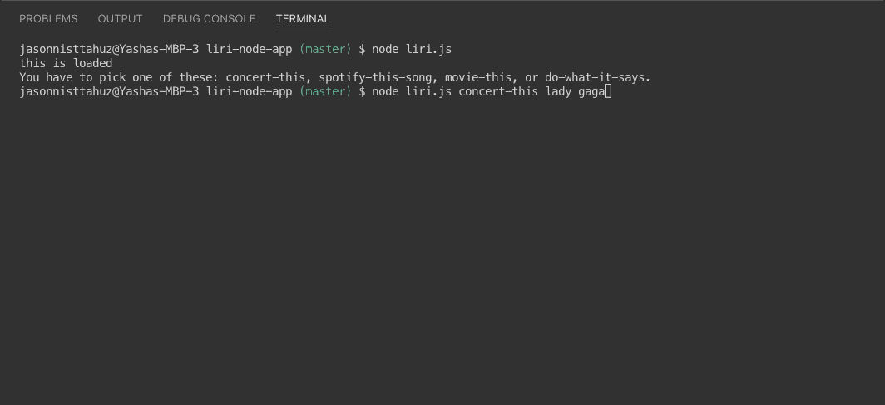
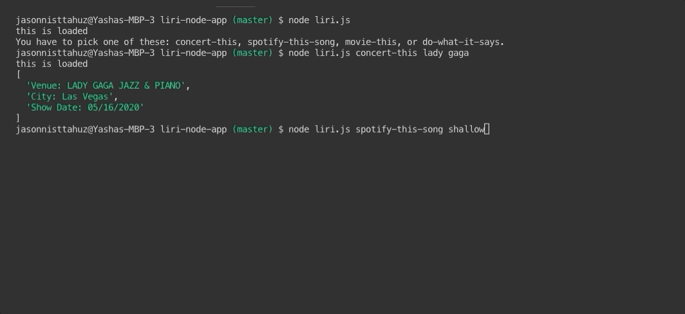
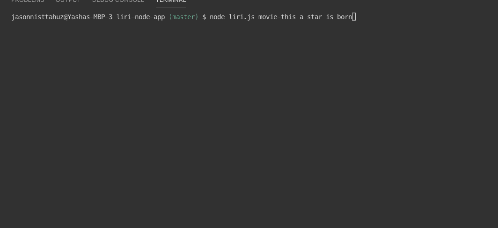
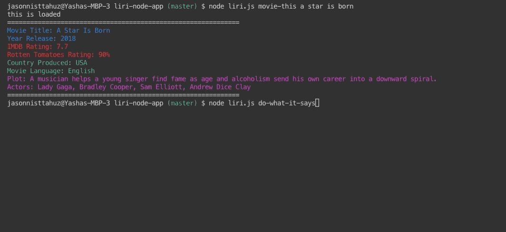

# liri-node-app

LIRI is like iPhone's SIRI. However, while SIRI is a Speech Interpretation and Recognition Interface, LIRI is a _Language_ Interpretation and Recognition Interface. LIRI will be a command line node app that takes in parameters and gives you back data.

You need to first open up your terminal and enter node liri.js into your command line.

- You must choose either
  - concert-this
  - spotify-this
  - movie-this
  - do-what-it-says

If you do not you will get an error message.

**Concert-This**

This will search the Bands in Town Artist Events API for an artist and render the following information about each event to the terminal:

- Name of the venue
- Venue location
- Date of the Event

**Spotify-This**

This will use both the node-spotify-api package and the Spotify API in order to retrieve the following song information:

- Artist name
- The song's name
- A preview link of the song from Spotify
- The album that the song is from

**Movie-This**

This will use axios package in order to retrieve the following movie information:

- Movie Title.
- Year Release.
- IMDB Rating.
- Rotten Tomatoes Rating.
- Country that Produced movie.
- Movie Language.
- Plot of the movie.
- Actors in the movie.

If no movie is entered the program will output data for the movie 'Mr. Nobody.'

     * If you haven't watched "Mr. Nobody," then you should: <http://www.imdb.com/title/tt0485947/>

     * It's on Netflix!

**Do-What-It-Says**

IRI will take the text inside of random.txt and then use it to call one of LIRI's commands.

